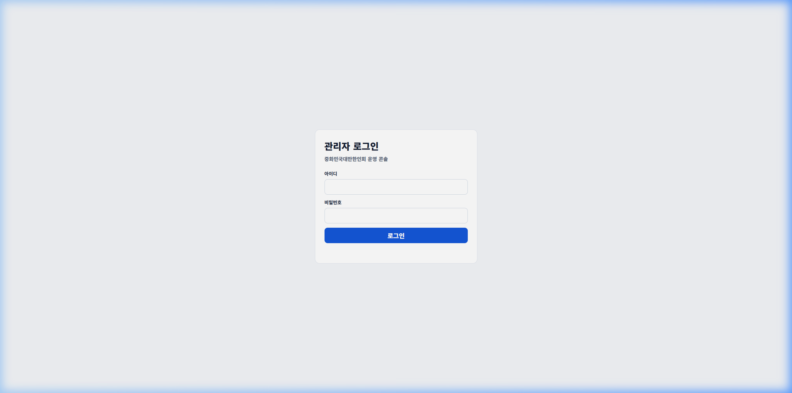
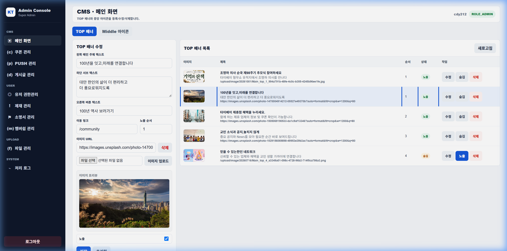
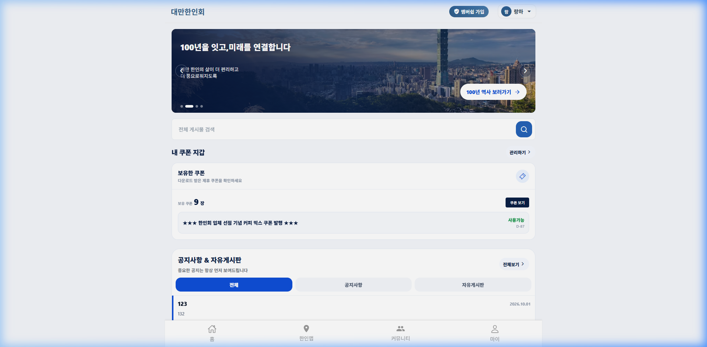
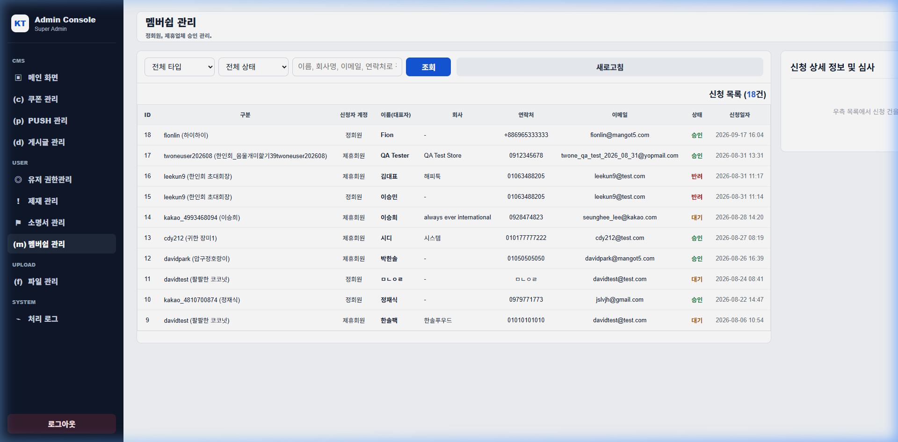
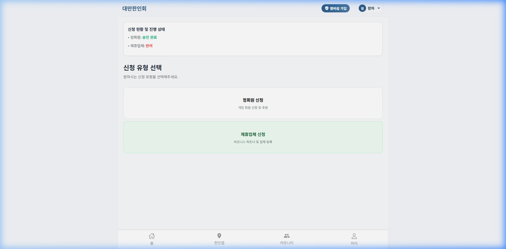
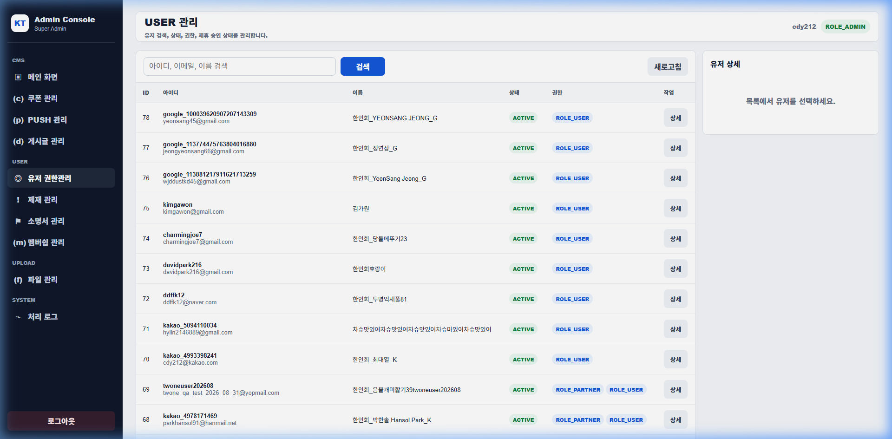
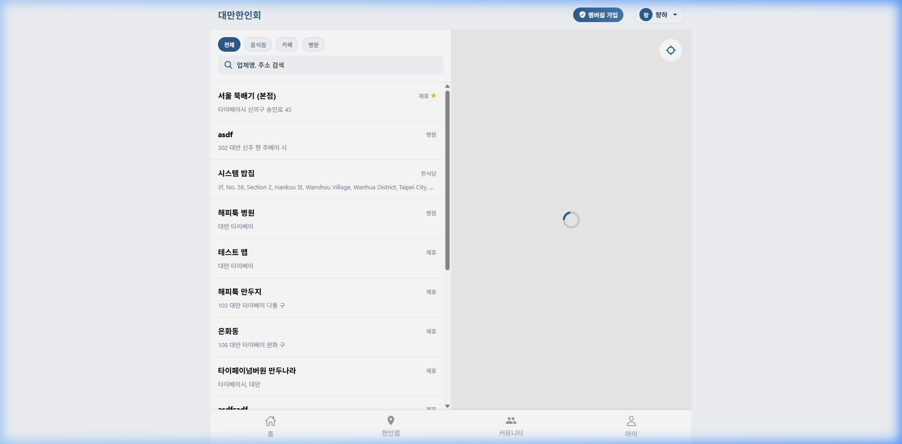
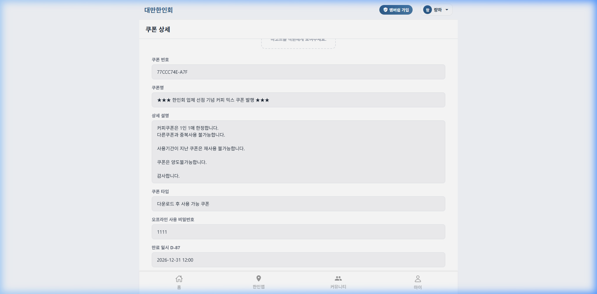
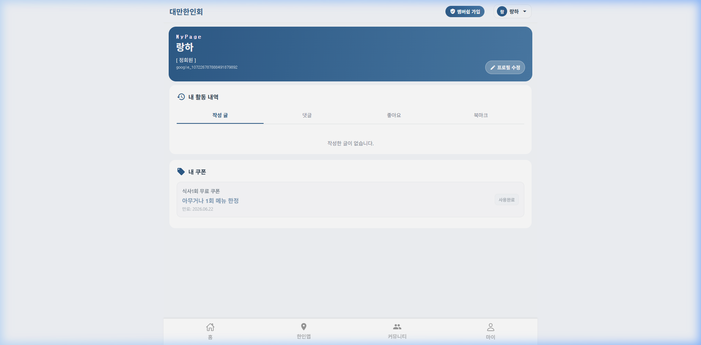
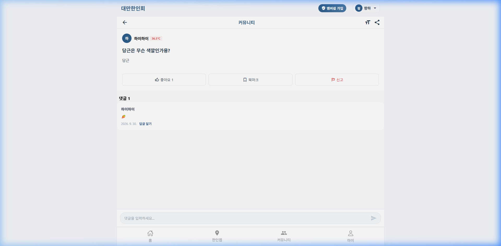

# 한인회 통합 운영 매뉴얼 (Operator Manual)

---

## 0. 운영 전체 플로우 및 빠른 목차

### 0-1. 전체 운영 워크플로우 트리

```text
[한인회 통합 운영 체계]
│
├── 1. 계정 및 권한 수명주기
│    ├── 일반 가입 (ROLE_USER) ──> 이메일/소셜 인증 (F/register)
│    ├── 정회원 심사 ──> 증빙 검토 ──> 승인(apply) / 반려(reject) (A/membership) ──> 정회원 (ROLE_REGULAR)
│    └── 제휴업체 심사 ──> 사업자 검토 ──> 승인 (A/membership) ──> 제휴사 (ROLE_PARTNER)
│
├── 2. 메인 전시 운영 (CMS)
│    └── TOP 배너 관리 (최대 5건, 순서/링크/이미지) (A/mainContent) ──> 메인 상단 반영 (F/main)
│
├── 3. 상생 제휴 및 혜택 운영
│    ├── 한인맵 매장 관리 ──> 매장 신규 등록 (+ 버튼) / 정보 수정 (F/store, F/store/manage)
│    └── 쿠폰 발행 및 정산 ──> 쿠폰 생성 (F/coupon/manage/create) ──> 정회원 발급 ──> 매장 PIN 검증 (F/coupon/use)
│
└── 4. 커뮤니티 및 제재 관리
     ├── 게시글/댓글 모니터링 ──> 신고 접수 ──> 블라인드/삭제 (A/userPosts)
     └── 불량 회원 정지 (A/sanctions) ──> 소명서 심사 (A/sanctionCertificate)
```

### 0-2. 파트별 바로가기 및 관리 URL 목차

| 파트 | 주요 업무 | 관리자 URL (A) | 사용자 확인 URL (F) |
|---|---|---|---|
| [PART 1. 접속 및 권한 체계](#part-1-접속-및-권한-체계) | 관리자 로그인, 역할별 접근 제어 | `https://koreans.tw/admin/index.html` | `https://koreans.tw/login` |
| [PART 2. 메인 CMS 관리 (TOP 배너)](#part-2-메인-cms-관리-top-배너) | TOP 배너 전시/관리 | `https://koreans.tw/admin/index.html?section=mainContent` | `https://koreans.tw/main` |
| [PART 3. 멤버십 심사 관리](#part-3-멤버십-심사-관리) | 정회원 및 제휴업체 등급 심사/승인 | `https://koreans.tw/admin/index.html?section=membership` | `https://koreans.tw/membership` |
| [PART 4. 회원 정보 및 계정 관리](#part-4-회원-정보-및-계정-관리) | 회원 검색, 계정 상세 정보 확인 | `https://koreans.tw/admin/index.html?section=users` | `https://koreans.tw/mypage` |
| [PART 5. 제휴업체 및 한인맵 매장](#part-5-제휴업체-및-한인맵-매장-운영) | 매장 등록, 카테고리/좌표, 제휴 마커 | `https://koreans.tw/store/manage` | `https://koreans.tw/store` |
| [PART 6. 쿠폰 발행 및 매장 PIN 사용](#part-6-쿠폰-발행-및-매장-현장-pin-사용) | 쿠폰 생성, 발급 이력, 현장 결제 차감 | `https://koreans.tw/admin/index.html?section=coupons` | `https://koreans.tw/coupon` |
| [PART 7. 커뮤니티 게시글 및 신고 관리](#part-7-커뮤니티-게시글-및-신고-관리) | 게시글 모니터링, 신고 검토 및 숨김/삭제 | `https://koreans.tw/admin/index.html?section=userPosts` | `https://koreans.tw/community` |
| [PART 9. 불량 회원 정지 및 소명서 심사](#part-9-불량-회원-정지-및-소명서-심사) | 이용 정지 등록, 소명서 검토 및 해제 | `https://koreans.tw/admin/index.html?section=sanctions` | `https://koreans.tw/block` |

---

## PART 1. 접속 및 권한 체계

### 1-1. 업무 워크플로우

```text
[운영자 접속] ──> https://koreans.tw/admin/index.html 로그인 ──> 세션 확인 ──> 권한(ROLE_ADMIN) 콘솔 진입
[제휴사 접속] ──> https://koreans.tw/login ──> 제휴사 계정 로그인 ──> 매장/쿠폰 관리 진입
[사용자 접속] ──> https://koreans.tw/login (일반/소셜) ──> 권한별 (ROLE_USER, ROLE_REGULAR) 화면 진입
```

### 1-2. 접속 URL 및 권한 명세

- 운영자 콘솔: `https://koreans.tw/admin/index.html`
- 프론트 로그인: `https://koreans.tw/login`

| 역할 코드 | 표시 명칭 | 접근 가능 메뉴 |
|---|---|---|
| ROLE_ADMIN | 최고 운영자 | 관리자 콘솔 전체 (배너, 심사, 회원, 쿠폰, 게시글, 제재 관리) |
| ROLE_PARTNER | 제휴업체 | 한인맵 내 매장 등록/수정, 자체 쿠폰 생성/관리 |
| ROLE_REGULAR | 정회원 | 일반 기능 + 제휴 쿠폰 다운로드/사용, 정회원 전용 커뮤니티 |
| ROLE_USER | 일반회원 | 기본 게시판 열람/작성, 정회원 및 제휴사 신청 |

### 1-3. 운영 화면 스크린샷



---

## PART 2. 메인 CMS 관리 (TOP 배너)

### 2-1. 업무 워크플로우

```text
[메인화면 설정 진입] ──> TOP 배너 선택
  │
  ├── 1. 제목 / 설명 / 링크 입력 (앱 내 경로 또는 외부 URL)
  ├── 2. 정렬 순서 (1~99) 및 활성화 상태(Active) 체크
  ├── 3. 이미지 업로드 (배너 규격 권장 1200x600 px)
  └── 4. [저장] 클릭 ──> 사용자 화면(https://koreans.tw/main) 새로고침하여 즉시 노출 검증
```

### 2-2. 주요 URL 및 설정 기준

- 관리 URL: `https://koreans.tw/admin/index.html?section=mainContent`
- 반영 확인 URL: `https://koreans.tw/main`
- API 엔드포인트: `GET /api/v2/main/top-banners`

| 구분 | 최대 활성 개수 | 정렬 기준 | 필수 입력 항목 |
|---|---|---|---|
| TOP 배너 | 최대 5개 | 순서 오름차순, 동일 순서 시 최신 등록순 | 제목, 이미지, 이동 링크, 버튼 텍스트 |

### 2-3. 운영 화면 스크린샷

- 관리자 배너 CMS 화면:


- 사용자 메인 화면 반영 결과:


---

## PART 3. 멤버십 심사 관리

### 3-1. 업무 워크플로우

```text
[사용자 신청 (https://koreans.tw/membership)]
  │   - 정회원(REGULAR): 거주 증빙 서류 제출
  │   - 제휴사(PARTNER): 사업자등록증 및 매장 소개 자료 제출
  ▼
[운영자 접수 (https://koreans.tw/admin/index.html?section=membership)]
  │
  ├── 대기(request) 목록 조회 ──> 신청 상세 확인 ──> 첨부 서류 검토
  │
  ├── [승인 (apply)] ──> 회원 권한 자동 부여 (REGULAR: role_id 3, PARTNER: role_id 4)
  │                      └── 사용자 재로그인 시 혜택 즉시 활성화
  │
  └── [반려 (reject)] ──> 사유 필수 입력 ──> 사용자 화면에 사유 노출 및 재신청 유도
```

### 3-2. 주요 URL 및 심사 상태 정의

- 관리 URL: `https://koreans.tw/admin/index.html?section=membership`
- 신청/확인 URL: `https://koreans.tw/membership`, `https://koreans.tw/mypage`

| 상태 코드 | 한글 명칭 | 운영자 처리 및 시스템 동작 |
|---|---|---|
| request | 승인 대기 | 신규 신청 건. 운영자 검토 필요 |
| apply | 승인 완료 | 해당 역할(Role) 추가 부여. 사용자는 재로그인 후 즉시 반영 |
| reject | 반려 처리 | 미비 서류 안내. 사용자 화면에 사유 표시 및 재신청 허용 |
| cancel | 신청 취소 | 사용자가 직접 취소했거나 권한 회수 처리된 건 |

### 3-3. 운영 화면 스크린샷

- 관리자 멤버십 심사 화면:


- 사용자 멤버십 현황 화면:


---

## PART 4. 회원 정보 및 계정 관리

### 4-1. 업무 워크플로우

```text
[회원 조회] ──> 아이디/닉네임/이메일 검색 (https://koreans.tw/admin/index.html?section=users)
  │
  └── 정상 회원 ──> 기본 계정 정보, 가입일, 보유 역할 확인
```

### 4-2. 주요 URL

- 회원 관리 URL: `https://koreans.tw/admin/index.html?section=users`
- 사용자 마이페이지 URL: `https://koreans.tw/mypage`

### 4-3. 운영 화면 스크린샷

- 관리자 회원 관리 화면:


---

## PART 5. 제휴업체 및 한인맵 매장 운영

### 5-1. 업무 워크플로우

```text
[제휴 권한 승인 (ROLE_PARTNER)] ──> https://koreans.tw/store 접속 ──> 우측 상단 '+' 버튼 클릭
  │
  ├── 매장 정보 입력 (업체명, 업종 카테고리, 대표 연락처)
  ├── 주소 검색 및 지도 좌표 자동 매핑
  └── 매장 등록 완료 ──> 한인맵 실시간 마커 및 목록 생성 (https://koreans.tw/store)
```

### 5-2. 주요 URL

- 매장 탐색/등록: `https://koreans.tw/store`
- 매장 수정/관리: `https://koreans.tw/store/manage`

### 5-3. 운영 화면 스크린샷

- 한인맵 매장 화면:


---

## PART 6. 쿠폰 발행 및 매장 현장 PIN 사용

### 6-1. 업무 워크플로우

```text
[쿠폰 발행] (제휴사 https://koreans.tw/coupon/manage/create 또는 관리자 https://koreans.tw/admin/index.html?section=coupons)
  │   - 제목, 유효기간, 발급유형, 직원 확인 PIN (숫자 4~6자리) 설정
  ▼
[사용자 다운로드] (정회원 전용 https://koreans.tw/coupon)
  │   - [쿠폰 받기] 클릭 ──> 내 보관함(https://koreans.tw/coupon/my)으로 즉시 저장
  ▼
[매장 현장 사용]
  │   - 고객이 매장 직원에게 내 쿠폰 화면 제시
  │   - 직원이 확인 비밀번호(PIN) 직접 입력 ──> POST /api/v2/coupon/use
  └── 즉시 [사용 완료] 전환 및 재사용 차단
```

### 6-2. 주요 URL 및 쿠폰 분류

- 쿠폰 관리(운영자): `https://koreans.tw/admin/index.html?section=coupons`
- 쿠폰 생성(제휴사): `https://koreans.tw/coupon/manage/create`
- 쿠폰 다운로드(사용자): `https://koreans.tw/coupon`
- 내 보관함: `https://koreans.tw/coupon/my`

| 쿠폰 유형 | 발급 대상 | 수량 관리 기준 |
|---|---|---|
| UNIVERSAL | 모든 정회원 | 누구나 제한 없이 다운로드 가능 (계정당 1회) |
| LIMITED | 선착순 정회원 | 설정된 선착순 수량 소진 시 발급 자동 마감 |
| PERSONAL | 특정 지정 회원 | 관리자가 지정한 타깃 사용자에게만 개별 지급 |

### 6-3. 운영 화면 스크린샷

- 현장 PIN 검증 모달:


- 사용자 마이페이지 보관함:


---

## PART 7. 커뮤니티 게시글 및 신고 관리

### 7-1. 업무 워크플로우

```text
[게시글 모니터링] ──> https://koreans.tw/admin/index.html?section=userPosts
  │
  ├── 정상 게시글 ──> 열람 및 이력 확인
  └── 불량/신고 게시글 ──> 신고 내용 검토 ──> [숨김/블라인드] 또는 [영구 삭제]
```

### 7-2. 주요 URL

- 게시글/신고 관리: `https://koreans.tw/admin/index.html?section=userPosts`
- 사용자 커뮤니티: `https://koreans.tw/community`

### 7-3. 운영 화면 스크린샷

- 커뮤니티 게시글 상세:


---

## PART 9. 불량 회원 정지 및 소명서 심사

### 9-1. 업무 워크플로우

```text
[불량 회원 적발 / 신고] ──> https://koreans.tw/admin/index.html?section=sanctions
  │
  ├── 1. 제재 등록 ──> 대상 회원 지정, 정지 기간 및 사유 입력 (저장 시 세션 차단)
  ├── 2. 시스템 차단 ──> 해당 회원은 로그인 시 이용 제한 페이지 (https://koreans.tw/block) 로 강제 이동
  └── 3. 소명서 심사 (https://koreans.tw/admin/index.html?section=sanctionCertificate)
       │    - 사용자 소명 내용 및 해명 증빙 확인
       └─── [소명 인용] 제재 즉시 해제 및 정상 계정 복원 / [기각] 정지 유지
```

### 9-2. 주요 URL

- 제재 관리: `https://koreans.tw/admin/index.html?section=sanctions`
- 소명서 검토: `https://koreans.tw/admin/index.html?section=sanctionCertificate`
- 이용 차단 화면: `https://koreans.tw/block`

### 9-3. 제재 및 소명 처리 기준

| 구분 | 처리 주체 | 상세 절차 및 시스템 반영 |
|---|---|---|
| 제재 등록 | 운영자 | 대상 회원 선택 후 정지 사유 및 일수(또는 영구) 지정. 저장 시 해당 계정은 즉시 세션 차단 |
| 차단 안내 | 시스템 | 제재된 계정 로그인 시 일반 화면 진입 불가 및 `https://koreans.tw/block`으로 강제 리다이렉트 |
| 소명서 제출 | 사용자 | 차단 화면에서 소명 사유 및 해명 증빙 자료 작성 후 제출 |
| 소명서 심사 | 운영자 | 제출된 소명서 검토 후 [승인] 시 제재 해제 및 정상 계정 복원, [기각] 시 제재 상태 유지 |
